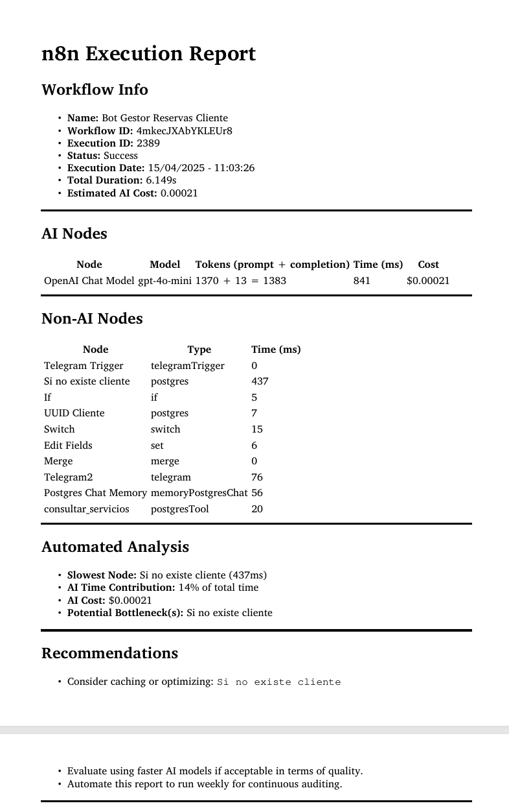
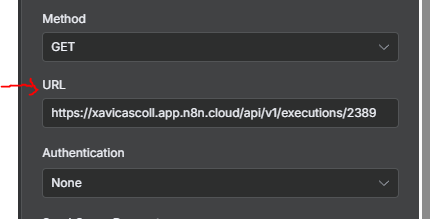
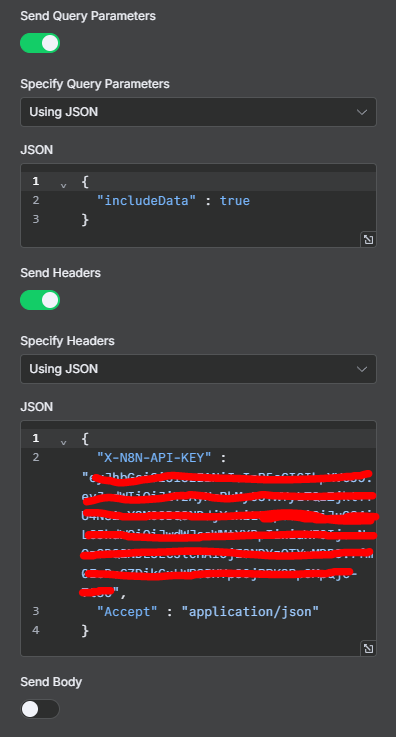
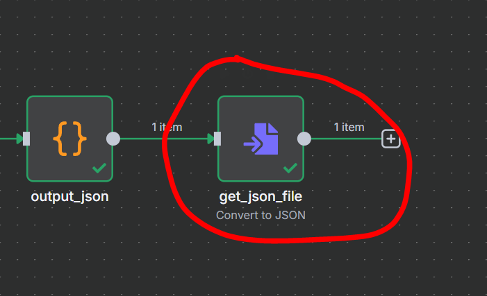
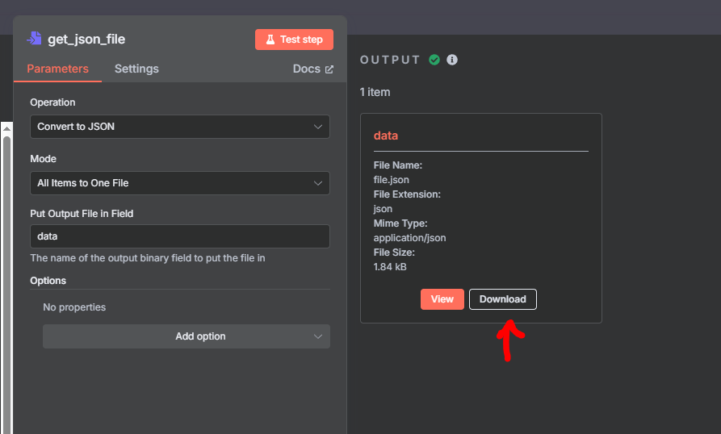

# n8n_execution_report
Analyze your n8n workflow executions and generate detailed reports in PDF format, including AI costs, node performance, and optimization suggestions.


## Features
- Summarizes execution duration, AI usage and estimated cost
- Detects AI nodes and calculates token usage
- Highlights slowest nodes and potential bottlenecks
- Outputs a clean, readable PDF report
- Simple to run locally with just Python

## Requirements
- Python 3.9 or higher
- Dependencies:
  ```bash
  pip install -r requirements.txt
 
## How to use it

### 1. Import included n8n workflow template

- Go to: n8n > Workflows > Import
- Load the template included in this repo

### 2. Modify the "get_execution_info" HTTP Request node in the workflow

- Set this configuration in the HTTP Request node

  #### - URL:

  ```bash
  https://<your-n8n-domain>/api/v1/executions/<execution_id>
  ```
  

  #### - Query and Headers parameters
    
  - Get n8n API Key -> [How to get n8n api token](https://docs.n8n.io/api/authentication/).
 
  - Query parameters
    
    1. Specify Query Parameters -> Select "Using JSON" in dropdown
    2. In JSON field
        {
          "includeData" : true
        }
    
  - Headers.

    {
      "X-N8N-API-KEY" : <YOUR-API-KEY>,
      "Accept" : "application/json"
    }
    

  #### - Example
   
  


### 3. Run the n8n workflow and get JSON file output

- Double click in "get_json_file" node

  

- Download the JSON file

  

### 4. Use python script to generate the report

- Get the script in repo directory
```bash
python auditor.py
```
- This will save in the same root a PDF file with your execution report.

## What's next?

Guys I want to upgrade this tool have things in mind...

- Support for multiple executions across time periods
- Visual charts for cost evolution and execution load
- Optional web interface for easier use — Our at least improve the accesibility to this tool, too much steps...

Right now, the most value in this is you guys tell me things to improve, bugs to fixes etc..

Feel free to open an [issue](https://github.com/Xavi1995/n8n_execution_report/issues)

This tool is not affiliated with n8n — just a side project to make auditing easier for developers.

And give me a :star: if you found this usefull (what I'm trying to be).
